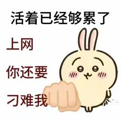
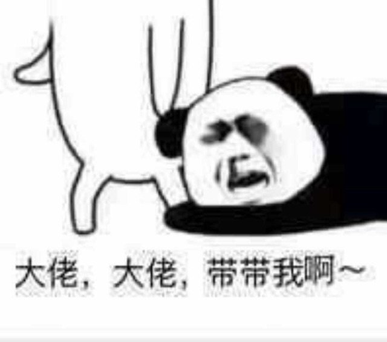
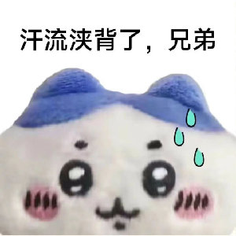
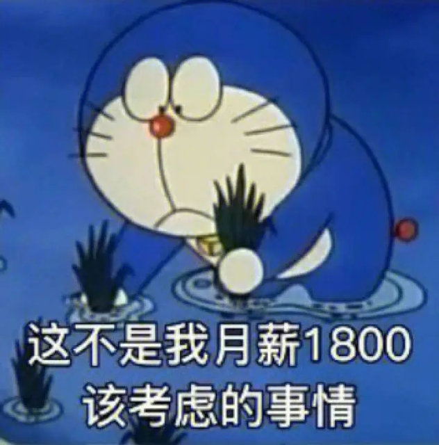
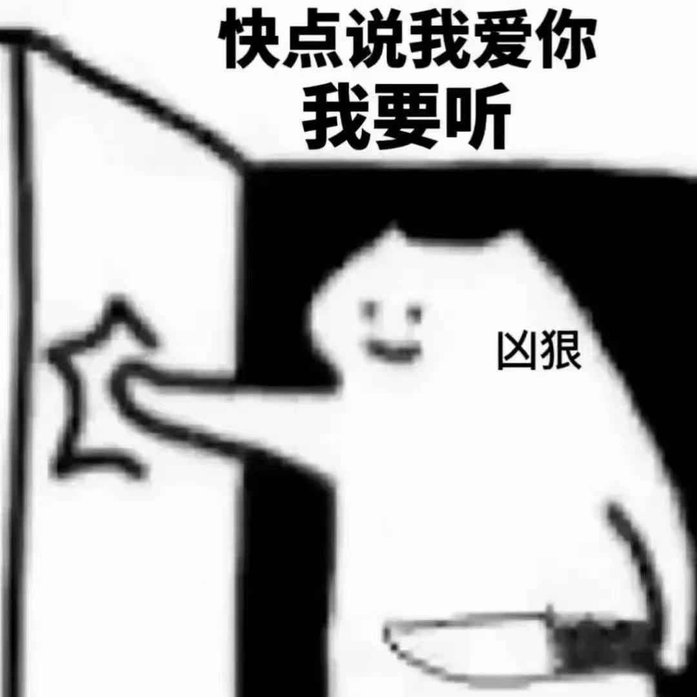
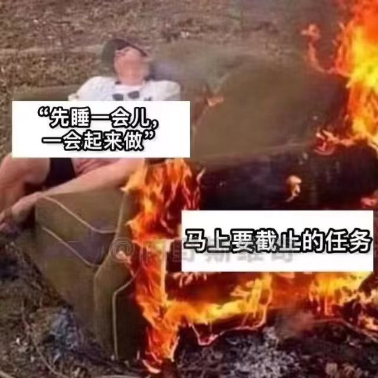

# Emo Visual Data

## 简介

这是一个表情包视觉标注数据集，它收集了5329个表情包并使用 [step-free-api](https://github.com/LLM-Red-Team/step-free-api) 项目通过跃问的多模态大模型完成的视觉标注。

## 完整文件下载

[Google Drive](https://drive.google.com/file/d/1RnDMCnNrDU2RTsZIywW1NQKM2tkNRFdC)

## 部分示例

**0f20b31d-e019-4565-9286-fdf29cc8e144.jpg**

这个表情包中的内容和笑点在于它展示了一只卡通兔子，兔子的表情看起来既无奈又有些生气，配文是“活着已经够累了，上网你还要刁难我”。这句话以一种幽默的方式表达了许多人在上网时可能会遇到的挫折感或烦恼，尤其是当遇到困难或不顺心的事情时。这种对现代生活压力的轻松吐槽使得这个表情包在社交媒体上很受欢迎，人们用它来表达自己在网络世界中的疲惫感或面对困难时的幽默态度。

----

**0fded1b9-52b6-42d5-9312-545fa03c269e.jpg**

这个表情包展示了一个卡通熊猫人物，它的表情似乎很是无奈和惆怅。图片中的文字“跑路 要不跑路吧”是一种幽默的表达，暗示着在面对困难或压力时，逃避或离开当前的处境可能是唯一的选择。这种自嘲的方式常常被用来轻松地表达对生活中某些挑战的无力感，从而引发共鸣和笑声。

----

**ff821158-31fe-4294-9de6-93e210cee69b.jpg**

这个表情包展示了一个卡通熊猫人物，它的表情看起来既滑稽又有些无奈。旁边有一只手正按着它的头，似乎在戏弄它。文字“大佬，大佬，带带我啊~”是一种网络流行语，通常用来表示请求别人的帮助或加入某个群体。这里的笑点在于熊猫的表情和这句夸张的求助语之间的反差，给人一种幽默而又带点哀求的感觉。

----

**bc8709c0-8ea6-49ca-afa9-be35552e1b5d.jpg**

这个表情包展示了一个卡通角色，它的脸上似乎因为努力或紧张而流汗，汗水从额头滴落。文字“汗流浃背了，兄弟”通常用来形容某人非常努力或处于非常紧张的状态。这个表情包的笑点在于它用夸张的方式表达了努力或紧张的情绪，使得这个场景看起来既有趣又可爱。

----

**ff496448-ded7-4e82-a964-f0e3ead38c85.jpg**

这个表情包展示了一个卡通角色，看起来像是哆啦A梦，它全身湿漉漉的，表情似乎有些无奈和困惑。图片中的文字是：“这不是我月薪1800该考虑的事情”，这句话增加了幽默感，因为它创造了一个不符合角色设定的情境，通常我们不会将一个无所不能的卡通角色与普通人的财务状况联系起来。这种反差和意外性产生了笑点。

----

**fbae4563-a2ff-44cb-8326-57a5a1b56f04.jpg**

这个表情包中的内容显示了一只卡通猫角色，它似乎在威胁或强烈要求某人说“我爱你”。猫的表情和手中的刀（虽然可能是玩具）营造了一种幽默的紧张气氛。这种将可爱与轻微的威胁元素结合起来的手法，是这个表情包的笑点所在。它通常用于轻松的社交媒体互动中，作为一种幽默的方式来表达对某人的爱或要求对方的爱。

----

**fa0df455-1576-402c-be12-0b279073e07a.jpg**

这个表情包显示了一个人在沙发上休息，而沙发的下半部分着火了。上面的文字是：“先睡一会儿，一会起来做”和“马上要截止的任务”。这个表情包的笑点在于它描绘了一个拖延的情景，一个人知道有一项即将截止的任务，但他选择先睡一会儿再做。这种对紧迫任务的轻松态度和拖延行为产生了幽默效果。
